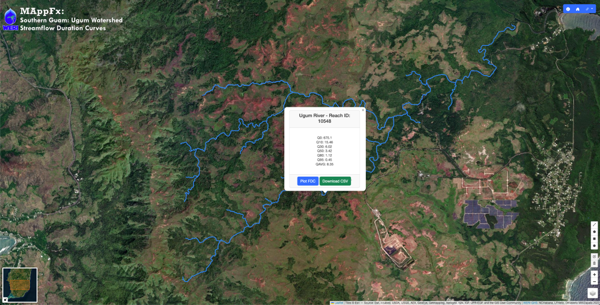

<h1 align="center">Southern Guam MAppFx: Ugum Watershed Streamflow Duration Curves</h1>

Figure 1. Preview of river selection with information pop-up.

## Abstract 
The prediction of streamflow variability is essential in many different water resources evaluation studies. Defining long term flow variability is essential in studies such as hydropower feasibility, evaluating surface water resources for water supply studies, low and high flow studies such as in-stream flow requirements, and other studies where it is required to define the variability of flows in a stream.

Predicting flow variability is normally accomplished by direct analyses of streamflow data for the stream in question or by applying a hydrologic inferential technique from a gaged to an ungaged stream or from a gaged location on a stream to an ungaged location on that same stream. Of course, the most reliable means is to use actual stream flow data measured at the point of interest. In 2015, WERI hydrologists developed a means of predicting flow variability at ungaged sites in Southern Guam, applying streamflow duration curve analysis.

However, the information developed in the streamflow studies were not readily available to anyone making studies that rely on predicting long term streamflow variability at ungaged sections of the river. With MAppFx, making flow variability information easily available to those making future water resources studies is now available to everyone. The MAppFx platform is an online interactive map and graph interface. The user of MAppFx will have an interactive map, similar to Google® Earth controls, and map features (line, point, polygon), upon selection have the option to view an interactive graph of a dataset associated to the map feature. The result is an effective and modern means of hydrologic information transfer. 

MAppFx, an online interactive map and graph application, applies JavaScript codes and libraries, to build the platform for the worldwide access of Guam’s flow duration analysis. MAppFx has recently been applied to make production well water quality history available worldwide. The Ugum River flow duration curve dataset is used as a manageable set in the first phase of the project. A second phase of this project will apply the MAppFx platform to the entire Southern Guam group of flow duration curves. 

> __Keywords__: data visualization, online information transfer, Southern Guam, Ugum watershed, flow variability, streamflow duraction curve analysis, web application

## WERI Technical Report No. 181
Published as a technical report on July 2023 and is available through the WERI website's _Reports and Publications_ section, [here](https://weri.uog.edu/reports-and-publications/). It is also available on the Guam Hydrologic Survey website, [here](https://guamhydrologicsurvey.uog.edu/index.php/2023/07/11/mappfx-southern-guam-ugum-watershed-flow-duration-curves/). 

## Authors
NC Habana, PhD ‧ LF Heitz, PhD, PE ‧ DK Valerio 

## Contributors 
DK Valerio ‧ MW Zapata 
